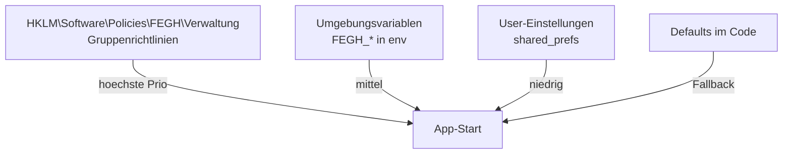

# MDM-Deployment (Intune / Windows Group Policy)

Fuer groessere Einrichtungen ist die manuelle Installation pro PC
keine Option. Die FEGH-Verwaltung laesst sich als **MSIX-Paket**
ueber Microsoft Intune oder Windows-Gruppenrichtlinien an Dutzende
Mitarbeiter-PCs automatisch verteilen.

## Funktionsweise im Detail

### Das Problem, das wir loesen

Eine wachsende Einrichtung mit 20-50 Bueromitarbeitern hat drei
konkrete Herausforderungen:

1. **Installation skaliert nicht manuell.** Wer soll 30 Mal in die
   Niederlassungen fahren und die App per USB einspielen?
2. **Updates muessen auf allen Geraeten synchron sein.** Wenn ein
   KoSIT-Bug gefixt wird, soll die Fix-Version am naechsten Tag
   ueberall laufen — nicht in 6 Wochen, wenn jemand sich meldet.
3. **Konfiguration soll zentral gepflegt werden.** Cloud-URL,
   Organisations-ID und SSO-Zwang sollten nicht von jedem
   Mitarbeiter selbst eingetippt werden.

MSIX + Intune loest alle drei:

- **Deployment**: Intune pushed das MSIX automatisch auf jedes
  verbundene Geraet.
- **Updates**: neue MSIX-Version hochladen, Intune rollt das
  innerhalb 24 h aus.
- **Konfiguration**: Gruppenrichtlinien-ADMX setzt
  Registry-Eintraege, die App liest sie beim Start vor den
  User-Einstellungen.

### Konkretes Szenario: 30 Geraete in 3 Niederlassungen

**Ausgangslage**: Assistenz gGmbH hat drei Niederlassungen (Berlin,
Hamburg, Koeln), insgesamt 30 Bueromitarbeiter mit Windows-11-PCs.
Alle Geraete sind in **Microsoft Intune** eingebunden (Entra ID
join + Autopilot).

**Tag 1 — IT-Administrator Jan richtet den Rollout ein.**

1. Jan baut das MSIX-Paket:
   ```powershell
   powershell -ExecutionPolicy Bypass -File scripts\build-msix.ps1
   ```
   Ergebnis: `FEGH-Verwaltung_0.3.0.0_x64.msix` (~25 MB)

2. **Code-Signing** mit EV-Zertifikat (durch IT-Dienstleister
   bereitgestellt): `SignTool.exe sign /fd SHA256 /a FEGH-Verwaltung_*.msix`

3. **Intune-Portal** (<https://intune.microsoft.com>):
   - Apps → Windows → Add → Line-of-Business App
   - MSIX hochladen
   - Zuweisung: Gruppe "Assistenz-Mitarbeiter" (alle 30 User)
   - Installationszeitpunkt: "Available for enrolled devices"

4. **ADMX-Template** unter `scripts/intune/FEGH-Verwaltung.admx` +
   `de-DE/FEGH-Verwaltung.adml` in Intune importieren:
   - Settings Catalog → Custom → ADMX import
   - Neue Profile mit den 6 FEGH-Policies:
     - Cloud-Basis-URL (gesetzt auf die Org-Cloud)
     - Cloud-Provider (Nextcloud)
     - Organisations-ID ("assistenz-ggmbh")
     - Auto-Update erlauben (aktiviert)
     - SSO-Login erzwingen (noch nicht — kommt in 3 Monaten)
     - SIEM-Export-URL ("udp://siem.assistenz.local:514")

5. **Rollout starten** — innerhalb von 2-4 Stunden sind alle 30
   Geraete installiert.

**Tag 2 — Mitarbeiter in Berlin loggt sich ein.**

Sie startet die App vom Startmenue. Die App:

1. Liest Registry-Policies aus `HKLM\Software\Policies\FEGH\Verwaltung`:
   - Cloud-URL, Provider, OrgId bereits gesetzt
   - SIEM-URL bereits gesetzt
2. **Ueberspringt** den Cloud-Setup-Dialog (Policies ueberschreiben)
3. Zeigt nur noch den "Per Einladungscode anmelden"-Button an.
4. Mitarbeiterin scannt ihren QR, gibt PIN ein, ist in 30 Sekunden
   einsatzbereit.

Audit-Events werden parallel lokal (`audit.log`) UND an die SIEM-URL
gesendet — Jan sieht in Splunk alle Logins in Echtzeit.

**Monate spaeter — Sicherheitsupdate.**

Ein CVE im `webdav_client`-Paket erfordert ein Patch. Jan:

1. Updated `pubspec.yaml`, baut neue MSIX `0.3.1.0`
2. Laedt sie in Intune hoch — ueberschreibt die alte Version
3. Intune rollt in 24 h an alle 30 Geraete aus, **ohne User-Aktion**
4. Beim naechsten App-Start laeuft die neue Version.

### Warum MSIX statt klassisches MSI?

| Aspekt | MSI (klassisch) | MSIX (modern) |
|--------|-----------------|---------------|
| Tooling | WiX, Inno Setup (extern) | `msix`-Dart-Paket, integriert |
| Bauzeit | 10-30 min | 30 sec |
| Updates | Re-Install oder Patch-Chain | Auto-Update via Store oder MDM |
| Sandboxing | keins | Windows-Container (App-Isolation) |
| Intune-Support | kompliziert (App-V-Wrap) | nativ (Line-of-Business) |
| Uninstall | manchmal Reste | atomar, restlos |
| Code-Signing | extern mit SignTool | in `msix:create` integriert |
| Flutter-Unterstuetzung | manuell mit WiX | direkt via `msix`-Paket |

Fuer Einrichtungen mit **Windows 10/11 + Intune/MDM** ist MSIX die
pragmatischere Wahl. Fuer aeltere Umgebungen (Windows 7/8, keine
MDM) bleibt MSI die Alternative.

### Konfigurations-Layer im Ueberblick



Policies ueberschreiben User-Einstellungen. Der Nutzer kann in der
App Werte sehen, aber die Felder sind **disabled** mit dem Hinweis
"durch Richtlinie verwaltet".

## Deployment-Schritte im Detail

### Voraussetzungen

- Windows 10 1809+ oder Windows 11
- Microsoft Intune-Lizenz (Microsoft 365 Business Premium oder
  Enterprise Mobility + Security)
- Geraete in Intune eingebunden (Autopilot / manuelles Enrollment)
- Code-Signing-Zertifikat (fuer Sideload: selbst signiert OK;
  fuer Store: EV-Zertifikat)

### MSIX bauen

```powershell
cd C:\fegh-verwaltung
powershell -ExecutionPolicy Bypass -File scripts\build-msix.ps1
```

Das Script laeuft durch:
1. `flutter pub get`
2. `flutter build windows --release`
3. `flutter pub run msix:create`
4. Zeigt Ergebnis-MSIX mit Groesse an.

### Code-Signing

**Selbstsigniert (fuer Tests):**

```powershell
$cert = New-SelfSignedCertificate -Type CodeSigningCert `
  -Subject "CN=FEGH" -KeyUsage DigitalSignature `
  -KeySpec Signature -CertStoreLocation Cert:\CurrentUser\My
Export-PfxCertificate -Cert $cert -FilePath fegh-dev.pfx `
  -Password (ConvertTo-SecureString -String "password" -Force -AsPlainText)
```

Zertifikat in `pubspec.yaml` eintragen:

```yaml
msix_config:
  certificate_path: fegh-dev.pfx
  certificate_password: password
```

**EV-Zertifikat (fuer Produktion):**

EV-Code-Signing-Zertifikate sind Hardware-token-gebunden (USB-Dongle).
Bezugsquelle: Sectigo, DigiCert, GlobalSign (~400 EUR/Jahr).
Signing dann direkt ueber den Token-Provider:

```powershell
signtool sign /fd SHA256 /tr http://timestamp.sectigo.com /td SHA256 `
  /a FEGH-Verwaltung_0.3.0.0_x64.msix
```

### Intune-Upload

1. <https://intune.microsoft.com> oeffnen
2. **Apps → All apps → Add**
3. App-Typ: **Windows app (Win32)** oder **Line-of-Business app**
4. MSIX hochladen
5. App-Informationen ausfuellen (Name, Version, Publisher)
6. Zuweisung: Benutzergruppe "FEGH-Mitarbeiter"
7. Installationskontext: **User** (nicht Device — weil User-spezifische
   Einstellungen im secure_storage pro User liegen)

### ADMX-Import fuer Group Policy

Die ADMX-Templates unter `scripts/intune/` werden kopiert nach:

- `C:\Windows\PolicyDefinitions\FEGH-Verwaltung.admx`
- `C:\Windows\PolicyDefinitions\de-DE\FEGH-Verwaltung.adml`

(auf dem **Domain Controller**, von wo Group Policy Management Console
sie zieht).

Im **Group Policy Management Editor**: Computer Configuration →
Policies → Administrative Templates → FEGH-Verwaltung

Dort lassen sich setzen:
- Cloud-Basis-URL
- Cloud-Provider (HiDrive / Nextcloud / ownCloud / Generic)
- Organisations-ID
- Auto-Update erlauben
- SSO-Login erzwingen
- SIEM-Export-URL

## Rechtlicher Hintergrund

- **Art. 32 DSGVO** — Zentrale Konfiguration ist eine dokumentier-
  bare TOM (niemand kann Endgeraete "anders" konfigurieren).
- **IT-Sicherheitsgesetz 2.0** — bei KRITIS-Einrichtungen ist
  zentrales Patch-Management ueber MDM praktisch Pflicht.
- **BSI IT-Grundschutz OPS.1.1.3** (Patch- und Aenderungsmanagement)
  — MSIX + Intune erfuellt die Anforderungen an kontrollierten
  Rollout.
- **§87 BetrVG** — Betriebsrat kann Mitbestimmung bei Intune-
  gesteuerter Konfiguration verlangen (Ueberwachungspotenzial
  muss bewertet werden — in unserem Fall gering, weil nur
  App-Parameter, keine Nutzeraktivitaet).

## Alternativen zu MSIX/Intune

| Szenario | Empfehlung |
|----------|------------|
| Einrichtung < 10 PCs, kein MDM | manuelle MSIX-Installation via Doppelklick |
| Einrichtung 10-50 PCs, Windows-Domain | MSIX + Gruppenrichtlinien |
| Einrichtung > 50 PCs, Entra ID | MSIX + Intune + ADMX |
| Mixed-OS (Windows + Mac + Linux) | separate Pakete, manuelles Deployment |
| Kein zentrales IT-Management | User-Selbstinstallation mit Setup-Wizard |
