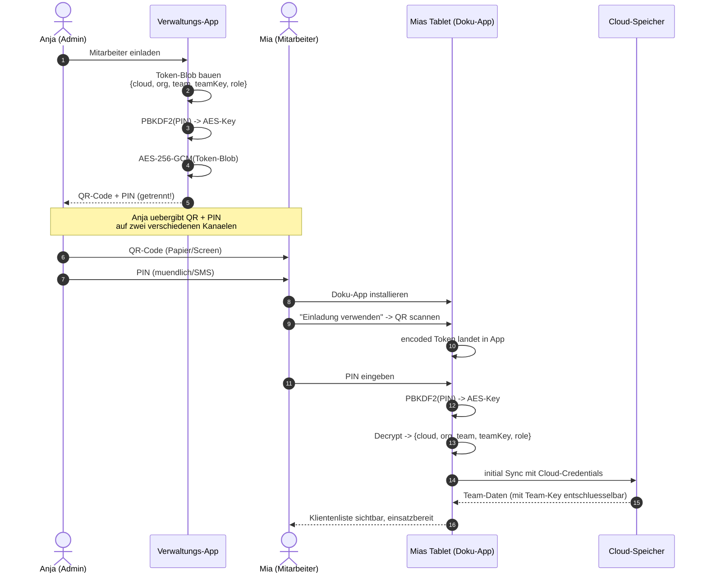

# Mitarbeiter-Einladung via QR-Code

Die Verwaltung ist der **primaere Ort** um neue Mitarbeiter an die
FEGH-Dokumentations-App anzubinden. Das passiert ueber einen
QR-Code (Provisioning-Token) plus PIN.

## Funktionsweise im Detail

### Das Problem, das wir loesen

Eine neue Mitarbeiterin soll auf ihrem Dienst-Tablet die Doku-App
einsatzbereit haben. Ohne strukturiertes Verfahren muesste sie:

1. Cloud-URL abtippen (fehleranfaellig)
2. Cloud-App-Passwort abtippen oder lesen (sicherheitskritisch)
3. Organisations-ID raten/nachfragen
4. Team-ID auswaehlen (woher wissen?)
5. Team-Key bekommen (wie sicher uebertragen?)
6. Rolle setzen (fehlt ein Klick = kein Zugriff)

Jeder dieser Schritte ist eine Fehlerquelle, jede schlechte Praxis
ein Datenschutzrisiko. Die QR-basierte Provisionierung kondensiert
die komplette Setup-Konfiguration in **einen QR-Code** — und
schuetzt ihn mit einer **6-stelligen PIN** (aus der Cryptographie-
bibliothek `fegh_crypto`, via PBKDF2 abgeleitet).

Die Mitarbeiterin **sieht keine Cloud-Credentials**. Sie bekommt
nur: QR-Code (auf einem Blatt oder Bildschirm) + PIN (muendlich,
per SMS oder separater Weg). In 30 Sekunden ist sie einsatzfaehig.

### Konkretes Szenario: Onboarding Mia

**Montag 09:15 — Admin Anja bereitet Mias Einladung vor.**

1. Anja oeffnet `Admin-Console → Mitarbeiter-Provisioning →
   Neuen Mitarbeiter einladen`
2. Formular:
   - E-Mail: mia.mueller@assistenz.local
   - Rolle: `team_member`
   - Teams: `hauptstrasse`
   - Cloud-App-Passwort einbetten: **ja** (ein dediziertes
     App-Passwort, **nicht** das Haupt-Passwort der Einrichtung)
   - Schutz-PIN: 6-stellig (wird von der App generiert — z. B.
     `483921`)
3. "QR erzeugen"
4. QR erscheint auf dem Bildschirm — Anja druckt ihn aus (oder
   zeigt ihn kurz via Screen-Share).

**09:20 — Uebergabe im Buero.**

Anja gibt Mia das Blatt mit QR-Code. Die **PIN bekommt Mia
**separat**, z. B. muendlich oder per SMS. Das ist keine Paranoia:
wer in den Papierkorb greift und die PIN dazulegt, bekommt
**Zugriff auf das Team der Organisation**. Die Trennung ist
Defense in Depth.

**09:25 — Mia installiert die Doku-App auf ihrem Tablet.**

1. Ersteinrichtung startet → sie waehlt "Einladungscode verwenden"
2. Kamera scannt den QR → Token landet in der App
   (noch verschluesselt)
3. PIN-Feld: Mia tippt `483921`
4. System:
   - PBKDF2(PIN, Salt) → AES-Key
   - Entschluesselt den Token mit diesem Key
   - Token enthaelt: Cloud-URL, App-Passwort, Org-ID, Team-ID,
     Team-Key (mit Salt kryptographisch abgesichert), Rolle, TOTP-
     Secret (optional)
5. Mia bestaetigt ihren Namen → fertig.

Ab jetzt sieht sie auf ihrem Tablet die Klienten ihres Teams,
kann Termine erfassen, Verlaufsberichte schreiben — **ohne je
Cloud-Credentials gesehen zu haben**.

**Dienstag — ein anderes Szenario: Mia's Tablet wird geklaut.**

Der Dieb hat das Geraet. Ohne das Entsperr-Passwort ist die App
zu — der DEK (Data Encryption Key, aus dem Passwort abgeleitet)
muss fuer jeden Zugriff neu abgeleitet werden. Ohne Passwort
kein DEK; ohne DEK kein MEK; ohne MEK keine Team-Keys; ohne
Team-Keys keine Klient-Daten.

**Was Anja zusaetzlich tut**:
1. Im Cloud-Kundenportal das App-Passwort rotieren. Das alte
   Token in Mias Geraet **wird wertlos** — selbst wenn der Dieb
   an Mias Entsperr-Code kommt, kann das Geraet nicht mehr
   synchronisieren.
2. Neues Tablet ausgeben, neuen Provisioning-QR fuer Mia, neue
   Daten auf neuem Geraet.

### QR-Provisioning als Sequenzdiagramm



<!-- SCREENSHOT: QR-Code-Anzeige in der Admin-Konsole mit PIN-Feld -->
<!-- SCREENSHOT: Einladungs-Scanner in der Doku-App -->

### Was der QR-Token alles enthaelt

Ein Provisioning-Token ist ein verschluesselter JSON-Blob:

```json
{
  "type": "egh-provisioning-v1",
  "org": "assistenz-ggmbh",
  "user": "mia.mueller@assistenz.local",
  "role": "team_member",
  "teams": ["hauptstrasse"],
  "teamKeys": { "hauptstrasse": "<base64>" },
  "hidrive": {
    "provider": "hidrive",
    "username": "...",
    "appPassword": "..."
  },
  "flags": { "managed": true, "forceInitialSync": true },
  "ts": "2026-04-21T09:15:12Z"
}
```

Der Blob wird mit `AES-256-GCM(PBKDF2(PIN, salt, 100k))` verschluesselt,
base64-kodiert und in einen QR-Code umgesetzt.

Kritisch: Der Token **bleibt gueltig**, bis:
- Er in der Admin-Verwaltung als `revoked` markiert wird, ODER
- Der Cloud-Admin das App-Passwort rotiert (dann laufen alle Tokens
  dieser Org ins Leere), ODER
- Das Ablaufdatum im Token erreicht ist (Default: 7 Tage).

### Sicherheits-Rationale

- **Zwei Kanaele (QR + PIN)**: Wer Zugriff auf eins hat, hat noch
  keinen Zugriff auf die Daten. Verlorener Ausdruck → unbrauchbar
  ohne PIN. Mitgehoerte PIN → unbrauchbar ohne Ausdruck.
- **Begrenzte Gueltigkeit**: 7 Tage Standard, 24 Stunden bei
  Hochsicherheit (Admin-Rollen). Nach Ablauf neu erzeugen.
- **Einmalverwendung**: Ein Token ist fuer ein Geraet gedacht. Wenn
  Mia ihn zweimal einloest (z. B. Tablet + privates Handy), wird im
  Audit-Log beides festgehalten.
- **Revoke-Funktion**: Unter "Provisioning-Tokens verwalten" kann
  ein Admin einen Token vorzeitig sperren — z. B. wenn sich Mia
  **vor** Einloesen umentscheidet.

### Rechtlicher Hintergrund

- **Art. 25 DSGVO** — Privacy by Design. Provisioning ueber
  verschluesselten Token ist genau das: der Endbenutzer bekommt
  nie Rohdaten.
- **Art. 32 DSGVO** — Sicherheit der Verarbeitung. QR + PIN ist
  eine dokumentierbare TOM.
- **§87 BetrVG** — Mitbestimmung bei Einfuehrung technischer
  Einrichtungen; der Provisioning-Prozess sollte in der
  Datenschutzvereinbarung beschrieben sein.

## Ablauf

### In der Verwaltung

1. **Admin-Console oeffnen** (Hauptmenue > Administration)
2. Auf Tab **Provisioning / Mitarbeiter-Einladung** gehen
3. Felder ausfuellen:
   - **E-Mail**: Cloud-Login des Mitarbeiters (falls gemanaged) oder
     reine Identifikation
   - **Rolle**: `team_member` (Standard), `team_lead` oder
     `org_auditor`
   - **Teams**: kommagetrennte Liste (z.B. `team-nord,team-mitte`)
   - **Cloud-App-Passwort** (optional): wenn vorgegeben, wird das
     Passwort ins Token eingebettet und der Mitarbeiter muss nichts
     mehr eingeben
   - **Schutz-PIN**: mindestens 6 Ziffern - diese PIN bekommt der
     Mitarbeiter auf separatem Weg (z.B. SMS, Anruf)
4. **QR erzeugen** klicken
5. Der QR-Code erscheint - entweder ausdrucken oder per Screen-Share
   zeigen, **NICHT** zusammen mit der PIN ueber denselben Kanal
   uebermitteln (Stichwort: Defense in Depth)

### Beim Mitarbeiter (Doku-App)

1. Ersteinrichtung der Doku-App starten
2. Pfad **"Einladungscode verwenden"** waehlen
3. QR-Code scannen (oder Token-Text einfuegen)
4. **PIN** eingeben
5. Doku-App entschluesselt Token, uebernimmt automatisch:
   - Organisations-ID
   - Cloud-Zugangsdaten (falls eingebettet)
   - Team-Zugehoerigkeit
   - Team-Keys
   - Rolle
   - TOTP-Secret fuer 2FA (optional)
6. Mitarbeiter legt persoenliches App-Passwort fest
7. Profil bestaetigen -> fertig, App startet im Team-Modus

## Token-Format

Das QR-Token ist ein PIN-verschluesseltes JSON mit Typ
`egh-provisioning-v1`. Der Klartext-Payload enthaelt:

```json
{
  "type": "egh-provisioning-v1",
  "org": "org-id",
  "user": "max@traeger.de",
  "role": "team_member",
  "teams": ["team-a"],
  "teamKeys": { "team-a": "<base64-32byte>" },
  "totp": "<base32-secret>",
  "hidrive": {
    "username": "hidrive-user@firma.de",
    "appPassword": "..."
  },
  "flags": {
    "managed": true,
    "forceInitialSync": true,
    "hideCredentials": true
  },
  "ts": "2026-04-18T14:30:00Z"
}
```

Verschluesselt via:
- PBKDF2 mit Salt `egh-provisioning-salt-v1`, 10000 Iterationen
- AES-256-GCM, kein AAD
- Output: Base64(utf8(json({nonce, ciphertext, tag})))

Wire-Format identisch zwischen Verwaltung (erzeugt) und
Dokumentation (verbraucht), verifiziert via `fegh_crypto`-
Contract-Tests.

## Sicherheit

!!! warning "Trennung von QR und PIN"
    QR-Code und PIN IMMER ueber unterschiedliche Kanaele. Beispiel:
    QR per E-Mail, PIN per SMS. Oder QR ausdrucken und uebergeben,
    PIN telefonisch.

!!! info "Token-Gueltigkeit"
    Das Token hat aktuell keinen Ablauf (statisches `ts`). Ein
    Mitarbeiter kann es prinzipiell lange nutzen. Fuer zusaetzliche
    Sicherheit: PIN nach erstem Login in der Verwaltung
    widerrufen (Re-Provisioning).

## Rollen-Uebersicht

| Rolle | Rechte |
|---|---|
| `org_admin` | Voller Zugriff, Org-Verwaltung |
| `pv_admin` | Verwaltungs-Admin (nur Verwaltungs-App) |
| `team_lead` | Team fuehren, Klienten + Mitarbeiter im Team verwalten |
| `team_member` | Fachkraft, Dokumentation + Terminerfassung |
| `org_auditor` | Nur-Lesen |

Siehe auch: [Rollen und Berechtigungen](rollen.md).

## Vergleich zur Doku-App

Die Doku-App hat einen eigenen Provisioning-Flow ueber
Einstellungen > Admin > Mitarbeiter einladen. Der erzeugte QR ist
**bitidentisch** zu dem der Verwaltung (selbes `fegh_crypto`).

Nutzung:

- **Solo-Admin (kleiner Traeger):** Doku-App reicht
- **Groessere Orga:** Verwaltung besser, wegen besserem Rollen-
  Editor, Batch-Provisioning und Integration mit Mitarbeiter-
  Stammdaten
