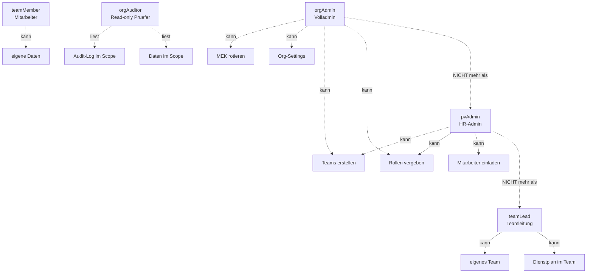

# Rollen und Berechtigungen

Die FEGH-Apps nutzen ein **rollen-basiertes Zugriffsmodell (RBAC)** mit fuenf Rollen, zentral gepflegt in der Cloud-Datei `administration/users/roles.json`.

## Funktionsweise im Detail

### Das Problem, das wir loesen

In einer Betreuungseinrichtung tun verschiedene Menschen verschiedene
Dinge. Aber **nicht jeder soll alles tun koennen**:

- Eine Teamleiterin braucht Zugriff auf ihre Klienten + Planung, aber
  nicht auf die Cloud-Credentials der Einrichtung.
- Ein Mitarbeiter quittiert Gaben, fuehrt Kasse, schreibt Berichte —
  aber er legt keine Teams an und verwaltet keine Schluessel.
- Ein externer Wirtschaftspruefer darf einmalig im April ins
  Audit-Log schauen — aber keine Daten veraendern und nicht nach
  dem Termin bleiben.

Ohne strukturierte Rollen sitzt die Trennung in den Koepfen der
Mitarbeiter ("Ich klicke nicht auf Team-Keys") — das ist kein
Audit-Nachweis. Mit Rollen wird **technisch erzwungen**, was
fachlich vereinbart ist: der Mitarbeiter sieht den Button nicht
einmal.

### Konkretes Szenario: Pruefung durch externen Auditor

**03. April — Wirtschaftspruefer Dr. N. soll das Audit-Log 2025
sichten.**

Admin Anja bereitet das vor:

1. `Admin-Console → Rollen → Rolle zuweisen`
2. Neuer Eintrag in `roles.json`:
   ```json
   "dr.n@wp-mustermann.de": {
     "role": "orgAuditor",
     "auditScope": {
       "from": "2025-01-01",
       "to": "2025-12-31",
       "teams": "*"
     },
     "validUntil": "2026-04-30"
   }
   ```
3. Anja erzeugt fuer Dr. N. einen Provisioning-QR mit Rolle
   `orgAuditor`, gueltig bis 30. April.
4. Dr. N. scannt, sieht die App im **Read-Only-Modus**: Klienten,
   Termine, Audit-Log — alles lesbar, aber kein "Neu"-Button, kein
   "Bearbeiten", keine Export-Funktionen.
5. Am 30. April laeuft sein Token automatisch aus; zusaetzlich
   entfernt Anja seinen Eintrag aus `roles.json`.
6. Audit-Events `role.assigned` am 03.04. + `role.expired` am 30.04.

### Die fuenf Rollen im Ueberblick

Gibt es nicht-triviale Details hinter jeder Rolle. Die Tabelle unten
listet sie auf — aber in Szenarien wird klarer, was sie bedeuten:

- **orgAdmin** — der "Superuser" der Einrichtung. Kann Organisation
  auflosen, MEK rotieren, Teams erstellen, Rollen vergeben. Sollte
  auf **wenige Personen** beschraenkt sein (Inhaber,
  Einrichtungsleitung). Zwei Admins sind gut (Vier-Augen-Prinzip,
  gegenseitige Vertretung bei Ausfall).
- **pvAdmin** — Personalverwaltungs-Admin. Kann Mitarbeiter einladen,
  Rollen innerhalb der Org aendern, Teams verwalten — aber **nicht**
  die Org-Einstellungen und **nicht** MEK rotieren. Fuer
  Einrichtungen mit einer dedizierten HR-Person.
- **teamLead** — Teamleitung eines spezifischen Teams. Darf
  Mitarbeiter in ihr Team aufnehmen, Schichten planen, Klienten-
  Zuweisungen bearbeiten. Kein Zugriff auf andere Teams.
- **teamMember** — Standardrolle. Darf im eigenen Team lesen und
  schreiben (Termine, Berichte, Medikation, Kassenbuch).
- **orgAuditor** — Read-Only-Pruefer. Alle Lesezugriffe, keine
  Veraenderungen. Mit `auditScope`-Einschraenkung auf Zeitraum
  und Teams.

### Rollen-Hierarchie als Diagramm



<!-- SCREENSHOT: roles.json-Editor mit Benutzer-Liste und Rollen-Dropdowns -->

### Wie roles.json technisch funktioniert

- Die Datei liegt verschluesselt in der Cloud unter
  `administration/users/roles.json`
- Bei jedem App-Start laedt das Geraet die Datei und cached sie fuer
  die Session
- Vor jeder schreibenden Aktion prueft das Geraet lokal die Rolle
  (schnell, kein Roundtrip)
- Bei Rollenwechsel (im zentralen roles.json) propagiert die
  Aenderung beim naechsten Sync-Zyklus (~5 Minuten)

Das hat eine Implikation: Ein **Downgrade** (Rolle entfernt) wirkt
erst nach Sync. Fuer **sofortige Sperrung** muss zusaetzlich das
App-Passwort im Cloud-Kundenportal rotiert werden — dann verliert
das Geraet des alten Benutzers sofort den Cloud-Zugang.

### Die Inhaltssperre der Doku-App

Auch die Doku-App laedt dieselbe `roles.json`. Ein Mitarbeiter auf
dem Tablet hat genau die Rechte, die sein Eintrag in der Datei
erlaubt. Das heisst:

- Teamleiterin Lara kann auf dem Tablet Klient-Zuweisungen machen
  (gleicher RBAC-Check wie in der Verwaltung)
- Mitarbeiterin Mia sieht den Button nicht einmal

Die RBAC-Logik ist **eine**, implementiert in `fegh_core`, benutzt
von beiden Apps.

### Rechtlicher Hintergrund

- **§67a SGB X** — Sozialgeheimnis; RBAC ist die technische
  Umsetzung des Need-to-know-Prinzips.
- **Art. 32 DSGVO** — Zugriffskontrolle. Rollen mit dokumentierbarer
  Rechtezuordnung sind eine TOM.
- **Art. 30 DSGVO** — Verzeichnis der Verarbeitungstaetigkeiten muss
  dokumentieren, wer zu welchen Datenarten Zugang hat. Die
  `roles.json` ist dafuer das technische Dokument.
- **§87 BetrVG** — Mitbestimmung bei Rollen-Definitionen; wer wem
  welche Rechte gibt, ist mitbestimmungspflichtig.

## Die fuenf Rollen

| Rolle | Bedeutung |
|-------|-----------|
| `orgAdmin` | Volladministration — kann Organisation, Admins, Team-Keys und die `roles.json` selbst verwalten. |
| `pvAdmin` | Personalverwaltungs-Admin — alle Funktionen von `orgAdmin` **ausser** Organisationsaenderungen und Key-Rotation. |
| `teamLead` | Team-Leitung — pflegt Mitarbeiter, Dienstplan, Klienten der **eigenen Teams**. |
| `teamMember` | Mitarbeiter — sieht nur Dinge, die ihn/sie direkt betreffen: eigene Schichten, zugewiesene Klienten, Medikationsgaben, Kassenbuch-Eintraege. |
| `orgAuditor` | Revisor — zeitlich und team-bezogen beschraenkter Lesezugriff (z. B. fuer Wirtschaftspruefer). |

## roles.json

Die Datei liegt im Cloud-Unterordner `administration/users/roles.json` und ist **mit dem Master-Encryption-Key verschluesselt**:

```json
{
  "users": [
    {
      "id": "anna.meier@traeger.de",
      "role": "team_lead",
      "teams": ["team-ost", "team-tagesstaette"]
    },
    {
      "id": "pruefer@externe-kanzlei.de",
      "role": "org_auditor",
      "auditScope": {
        "teams": ["team-ost"],
        "from": "2026-05-01T00:00:00Z",
        "to": "2026-05-31T23:59:59Z",
        "reason": "Jahrespruefung 2025"
      }
    }
  ]
}
```

- **`id`** — der Cloud-Benutzername (meist E-Mail), normalisiert in Kleinschrift.
- **`role`** — einer der fuenf Werte: `org_admin`, `pv_admin`, `team_lead`, `team_member`, `org_auditor`.
- **`teams`** — die IDs der Teams, fuer die die Rolle gilt (nur bei `team_lead` und `team_member` relevant).
- **`auditScope`** — nur bei `org_auditor`: Zeitfenster (from/to) und optional Team-Filter.

## Sichtbarkeits-Matrix (Auszug)

Die Hauptnavigation der Verwaltung blendet Eintraege rollenabhaengig ein oder aus. Die [Navigations-Registry](../technik/architektur.md#navigation) entscheidet per `visibleFor(UserRole)`-Praedikat.

| Bereich | `orgAdmin` | `pvAdmin` | `teamLead` | `teamMember` | `orgAuditor` |
|---------|:-:|:-:|:-:|:-:|:-:|
| Meine Arbeit | — | — | ✓ | ✓ | — |
| Medikation (geben) | — | — | ✓ | ✓ | — |
| Kassenbuch (Eintrag) | — | — | ✓ | ✓ | — |
| Klienten-Liste | ✓ | ✓ | ✓ (Team) | ✓ (zugewiesen) | ✓ (Scope) |
| ICF | ✓ | ✓ | ✓ | ✓ | ✓ |
| Medikationsplaene (admin) | ✓ | ✓ | ✓ | — | ✓ |
| Dashboard | ✓ | ✓ | ✓ | — | ✓ |
| Mitarbeiter | ✓ | ✓ | ✓ | — | ✓ |
| Teams | ✓ | ✓ | ✓ | — | ✓ |
| Urlaub | ✓ | ✓ | ✓ | ✓ | — |
| Kapazitaet | ✓ | ✓ | ✓ | — | ✓ |
| Wohnraum | ✓ | ✓ | ✓ | — | ✓ |
| Dienstplan | ✓ | ✓ | ✓ | — | ✓ |
| Zeitnachweise | ✓ | ✓ | ✓ | ✓ | ✓ |
| Rechnungen | ✓ | ✓ | — | — | ✓ |
| Berichte | ✓ | ✓ | ✓ | — | ✓ |
| Einstellungen | ✓ | ✓ | ✓ | ✓ | ✓ |
| Backup-Manager | ✓ | — | — | — | — |

## Lifecycle einer Rolle

1. **Anlage**: Admin traegt den User in der `roles.json` ein (ueber Admin-Console oder direkte Bearbeitung).
2. **Provisioning**: Der neue Mitarbeiter bekommt einen Provisioning-QR (siehe [Einladung](einladung.md)), scannt ihn in der Doku-App oder Verwaltung ein.
3. **Zugriff**: Die App ruft `RolesPolicyService.refresh()` beim Start und zyklisch — Rolle wird aktuell gehalten.
4. **Wechsel**: Admin aktualisiert `roles.json` — bei der naechsten Sync sieht der User die neue Rolle.
5. **Revoke**: Admin entfernt den Eintrag — beim naechsten App-Start landet der User in der Default-Rolle `teamMember` mit leerer Team-Liste (keine Klienten sichtbar).

## Siehe auch

- [Mitarbeiter-Einladung](einladung.md)
- [Architektur](../technik/architektur.md)
