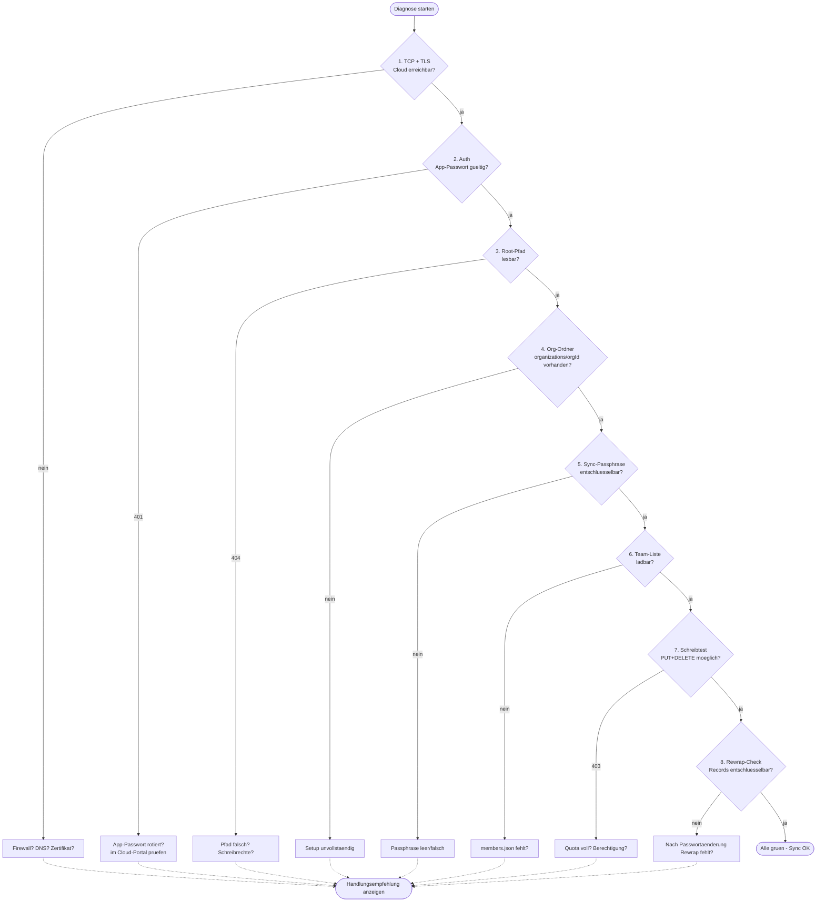

# Sync-Diagnose

Die Sync-Diagnose ist ein gefuehrter Test-Lauf, der nach jeder neuen Einrichtung und bei Fehlerbildern den Cloud-Sync Schritt fuer Schritt prueft.

## Funktionsweise im Detail

### Das Problem, das wir loesen

"Der Cloud-Sync geht nicht" hat **zehn moegliche Ursachen**:
falsche URL, abgelaufenes App-Passwort, abgelaufenes TLS-Zertifikat,
Quota voll, fehlender Root-Ordner, falsche Passphrase, Firewall-
Blockade, Proxy-Konfigurationsfehler, zerlegte Berechtigungen,
gecachter alter Team-Key. In einer Fehlermeldung steht typisch
"HTTP 401" oder "Verbindung fehlgeschlagen" — das reicht nicht, um
gezielt zu handeln.

Die Sync-Diagnose laeuft alle relevanten Schritte einzeln durch
und gibt pro Schritt einen eigenen Status mit **konkreter
Handlungsempfehlung**. Statt "Sync geht nicht" steht dann: "Schritt
3 von 8: Root-Verzeichnis nicht lesbar — Cloud-Quota pruefen oder
Root-Pfad korrigieren."

### Konkretes Szenario: Mia kann seit gestern nicht mehr syncen

**Dienstag 14:00 — Mia meldet: "Meine App sagt 'Sync fehlgeschlagen' seit heute morgen."**

Statt zu raten, laesst Anja sie die Sync-Diagnose laufen:

1. Mia: `Einstellungen → Admin-Tools → Sync-Diagnose starten`
2. Die Diagnose laeuft die 8 Schritte ab:

| Schritt | Ergebnis |
|---------|----------|
| 1. Cloud-Verbindung (TCP + TLS) | ✓ |
| 2. Authentifizierung (App-Passwort) | **✗ 401 Unauthorized** |
| 3. Root-Verzeichnis | (uebersprungen) |
| 4. Organisations-Ordner | (uebersprungen) |
| 5. Sync-Passphrase | (uebersprungen) |
| 6. Teams | (uebersprungen) |
| 7. Schreibtest | (uebersprungen) |
| 8. Rewrap-Check | (uebersprungen) |

**Diagnose zeigt an:**

> Schritt 2/8 fehlgeschlagen: Authentifizierung
>
> Moegliche Ursachen:
> - App-Passwort im Cloud-Kundenportal wurde rotiert
> - App-Passwort hat nicht die Schreib-Berechtigung
> - Benutzer-Account im Cloud-Kundenportal wurde gesperrt
>
> Loesung: App-Passwort im Cloud-Portal pruefen oder neu anlegen.

3. Anja schaut in ihr HiDrive-Konto: tatsaechlich — die IT hatte
   am Montagabend eine generelle Passwort-Rotation eingespielt. Das
   alte App-Passwort ist weg.
4. Anja erzeugt ein neues App-Passwort, tippt es bei Mia im
   `Einstellungen → Cloud-Zugang` ein, Sync laeuft wieder.

Statt stundenlanges Raten — in 3 Minuten geloest.

### Die Pruefschritte als Flowchart

<!-- SCREENSHOT: Sync-Diagnose-Ergebnisliste mit Haken und Kreuzen -->

### Die 8 Pruefschritte im Detail

1. **Cloud-Verbindung** — TCP-Handshake + TLS-Zertifikat. Versagt
   bei Firewall-Blockade, falschem Port, DNS-Problem, abgelaufenem
   Zertifikat.
2. **Authentifizierung** — HTTP-401-Check. Versagt bei falschem
   App-Passwort.
3. **Root-Verzeichnis** — `PROPFIND` auf den Root-Pfad. Versagt bei
   falschem Pfad oder fehlender Lese-Berechtigung.
4. **Organisations-Ordner** — Existiert `organizations/<orgId>`?
   Versagt bei fehlendem Setup.
5. **Sync-Passphrase** — Kann die Passphrase das Kanary-Record
   entschluesseln? Versagt bei leerer oder falscher Passphrase.
6. **Teams** — Liest die Team-Liste. Versagt bei fehlender
   `members.json` oder Team-Key-Fehlern.
7. **Schreibtest** — `PUT` und `DELETE` einer Test-Datei. Versagt bei
   fehlender Schreib-Berechtigung oder Quota-Ueberschreitung.
8. **Rewrap-Check** — Koennen bestehende Records mit dem aktuellen
   DEK entschluesselt werden? Versagt nach Passwort-Aenderung ohne
   Rewrap.

### Wann lohnt sich die Diagnose?

- **Nach jeder Ersteinrichtung** einmal durchspielen — schliesst
  alle Konfigurationsfehler aus.
- **Bei Fehlermeldungen** sofort — bevor geraten wird.
- **Nach MEK-Rotation** — pruefen, dass alle Re-Encryptions durchliefen.
- **Nach Cloud-Provider-Wechsel** — Umstellung von HiDrive auf
  Nextcloud macht vielleicht aus einem beratenden Moment einen
  produktiven.

### Rechtlicher Hintergrund

- **Art. 32 DSGVO** — Sicherheit der Verarbeitung. Sync-Probleme
  koennen zu Datenverlust fuehren (abgelehnte Schreibvorgaenge auf
  dem Tablet); die Diagnose ist Teil der Betriebssicherheit.
- **BSI IT-Grundschutz BSIK-CON.8** — Protokollierung + Beseitigung
  von Stoerungen; die Diagnose-Ergebnisse koennen als Incident-
  Dokumentation archiviert werden.

## Aufruf

Einstellungen → *Admin-Tools* → *Sync-Diagnose starten*.

## Was wird geprueft?

1. **Cloud-Verbindung** — TCP + TLS Handshake zum Provider.
2. **Authentifizierung** — Login mit Cloud-Benutzer und App-Passwort.
3. **Root-Verzeichnis** — ist der Root-Pfad lesbar? (`/users/<user>/eingliederungshilfe/` o. a.)
4. **Organisations-Ordner** — existiert `organizations/<orgId>`?
5. **Sync-Passphrase** — ist sie in den Settings gesetzt, und laesst sich damit ein Test-Record entschluesseln?
6. **MEK verfuegbar** — kann der Master-Encryption-Key entschluesselt werden?
7. **`roles.json`** — vorhanden und lesbar?
8. **Teams** — wie viele Teams hat die Organisation?
9. **Schreibtest** — kann eine temporaere Datei geschrieben und wieder geloescht werden?

Jeder Schritt gibt einen Status zurueck: gruen (OK), gelb (Warnung, nicht blockierend), rot (Fehler).

## Haeufige Fehlerbilder

### „Verbindung OK, aber 401 bei Schreiben"
→ App-Passwort hat keine Schreib-Berechtigung (bei HiDrive "WebDAV Business", bei Nextcloud/ownCloud "Files-Berechtigung" beim App-Token). Im Cloud-Kundenportal neu anlegen mit korrekten Scopes.

### „Passphrase leer"
→ Sync-Passphrase ist in den Einstellungen nicht gesetzt. Unter *Einstellungen → Sync-Passphrase* nachtragen.

### „Teams: 0"
→ Noch keine Teams angelegt. Das ist bei einem frischen Setup normal — *Personal → Teams → Neu anlegen*.

### „Root nicht gefunden"
→ Der Pfad stimmt nicht (z. B. Tippfehler im Optional-Root-Subdirectory). Im Setup-Wizard korrigieren.

### „415 bei MKCOL (STRATO HiDrive)"
→ Seit dem Umzug auf `webdav_client` geloest. Falls weiterhin: Update der Verwaltungs-App pruefen.

## Ausgabe

Die Diagnose bietet am Ende einen **Copy-Button** fuer den Zusammenfassungs-Text — praktisch fuer Support-Anfragen. Der Output enthaelt keine Passwoerter, nur Timestamps, Statuscodes und Pfade.

## Siehe auch

- [Admin-Console](console.md)
- [Cloud-Storage](../technik/cloud-storage.md)
