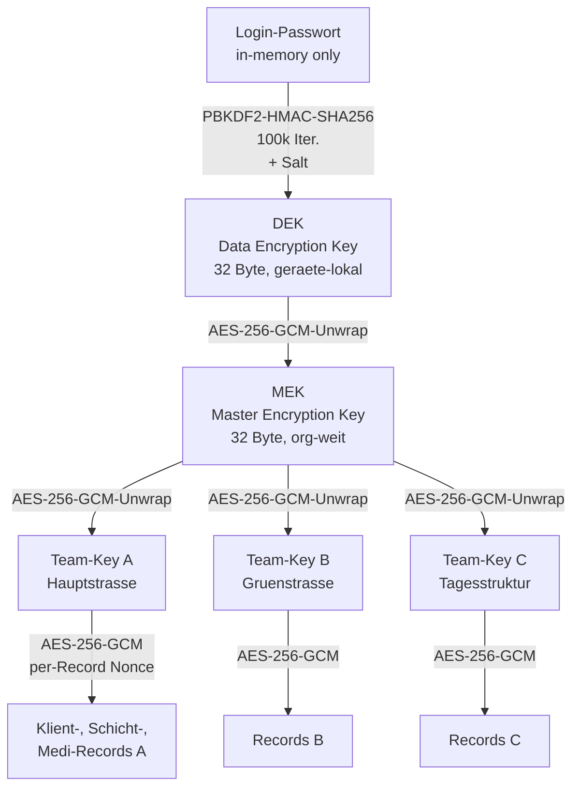

# Team-Keys verwalten

Team-Keys sind das **kryptographische Rueckgrat** der
Datenschutz-Architektur. Sie entscheiden, wer **welche** Team-Daten
entschluesseln kann — unabhaengig davon, wer Netzzugriff auf den
Cloud-Speicher hat.

## Funktionsweise im Detail

### Das Problem, das wir loesen

Alle Mitarbeiter nutzen denselben HiDrive-Account. Ohne weitere
Massnahme koennte jeder jeden Team-Ordner herunterladen und die
Daten anderer Teams lesen. Das verletzt:

- **§67a SGB X** (Sozialgeheimnis) — Mitarbeiter duerfen nur auf
  die Klienten ihres Teams zugreifen.
- **Art. 5 Abs. 1 lit. c DSGVO** (Datenminimierung) — niemand soll
  mehr sehen, als er fuer seine Aufgabe braucht.
- **Art. 32 DSGVO** (Privileged Access) — technisch erzwungene,
  nicht nur per Policy verbriefte Trennung.

Team-Keys loesen das kryptographisch: pro Team ein eigener AES-256-
Schluessel. Daten werden mit dem Schluessel des jeweiligen Teams
verschluesselt bevor sie auf die Cloud wandern. Selbst wenn ein
anderer Mitarbeiter die Dateien physisch herunterlaedt — ohne
Team-Key sind sie Zeichenbrei.

### Konkretes Szenario: Lars wechselt das Team

**Ausgangslage**: Lars ist Teamleitung von WG Hauptstrasse. Er hat
den Team-Key fuer "Hauptstrasse" auf seinem Geraet gecached.

**31. Dezember — Entscheidung: Lars uebernimmt ab 01.01. die neue WG
Gruenstrasse.** Das alte Team soll er nicht mehr sehen koennen.

**01. Januar — Admin Anja fuehrt den Wechsel durch:**

1. `Admin-Console → Teams → Hauptstrasse → Mitglied entfernen → Lars`

**Was automatisch passiert (~30 Sekunden):**

1. App generiert einen **neuen** 32-Byte AES-Key fuer Hauptstrasse
   (call it K2, alter war K1)
2. Alle Dateien im Team-Ordner auf HiDrive
   (`/eingliederungshilfe/organizations/assistenz-ggmbh/teams/hauptstrasse/`)
   werden heruntergeladen, mit K1 entschluesselt, mit K2 neu
   verschluesselt, wieder hochgeladen
3. K2 wird mit dem MEK verschluesselt und ersetzt K1 in
   `administration/teams/hauptstrasse/team-key.bin`
4. `members.json` des Teams wird aktualisiert (Lars raus)
5. Audit-Event `team.member.removed` + `team.key.rotated`

**Was auf Lars' Geraet passiert:**

- Beim naechsten Sync versucht sein Geraet, die Team-Key-Datei zu
  laden. Der **MEK auf seinem Geraet** kann den neuen Key K2 nicht
  entschluesseln (er wurde entfernt aus der Liste der fuer diesen
  Team-Ordner berechtigten Geraete).
- Seine lokal gecachten Dateien sind noch mit K1 entschluesselbar
  (nur temporaer — Cache wird beim naechsten Start geleert).
- Ab naechsten Start: keine Sicht mehr auf Hauptstrasse.

2. **Lars zu Gruenstrasse hinzufuegen:**

   `Admin-Console → Teams → Gruenstrasse → Mitglied hinzufuegen → Lars`

3. System erzeugt einen neuen Provisioning-QR fuer Lars' Geraet mit
   dem Team-Key von Gruenstrasse. Lars scannt ihn, ist sofort im
   neuen Team.

### Ablauf: Teamleitung rotiert Schluessel planmaessig

Auch ohne Personalwechsel sollte Team-Keys **jaehrlich** rotiert
werden — gute Praxis nach Art. 32 DSGVO. Anja im Dezember 2026:

1. `Admin-Console → Teams → Hauptstrasse → Team-Key rotieren`
2. Bestaetigung "Alle Dateien werden neu verschluesselt (~30 sec)"
3. Start → Audit-Event `team.key.rotated.scheduled`
4. Alle Mitglieder-Geraete erhalten den neuen Key beim naechsten
   Sync

### Notfall: MEK-Kompromittierung

Seltenster, aber schwerster Fall: der Master-Encryption-Key ist
kompromittiert (z. B. Anjas Geraet gestohlen, Login-Passwort
bekannt, Recovery-Codes koennten durchgesickert sein).

1. Anja loggt sich von einem neuen Geraet ein, nutzt einen
   **Recovery-Code**
2. `Admin-Console → Sicherheit → MEK rotieren`
3. App generiert neuen MEK, laedt alle Team-Keys, entschluesselt
   sie mit altem MEK, verschluesselt mit neuem MEK, speichert.
4. Alle Team-Mitglieder-Geraete bekommen beim naechsten Sync die
   neuen Team-Key-Verschluesselungen.
5. **Altes kompromittiertes Geraet** kann die neuen Files nicht
   mehr entschluesseln — Kompromittierung neutralisiert.

### Die kryptographische Schichtung als Diagramm



<!-- SCREENSHOT: Team-Key-Verwaltungs-Screen mit Rotations-Button -->

### Die kryptographische Schichtung

```
Login-Passwort
    └─ PBKDF2(100k) + Salt
        └─ DEK (Data Encryption Key, geraete-lokal)
            └─ entschluesselt: MEK (Master Encryption Key, org-weit)
                └─ entschluesselt: Team-Keys (pro Team)
                    └─ entschluesselt: Klient-Daten, Pläne, Reports
```

Warum drei Ebenen (DEK → MEK → Team-Key)?

- **DEK** ist geraetelokal. Wird das Geraet gestohlen, bringt das
  Cloud-File ohne DEK nichts.
- **MEK** ist organisationsweit. Ein einzelner Mitarbeiter mit
  neuem Geraet bekommt den MEK beim Provisioning — er muss kein
  spezifisches Team sehen.
- **Team-Key** ist team-spezifisch. So koennen einzelne Teams
  rotiert werden ohne die ganze Org neu zu verschluesseln.

### Rechtlicher Hintergrund

- **Art. 32 DSGVO** — Sicherheit der Verarbeitung. Krypto-Schichtung
  ist eine dokumentierbare TOM.
- **Art. 34 DSGVO** — Benachrichtigungspflicht bei Datenschutz-
  verletzung; bei Team-Key-Kompromittierung muss geprueft werden,
  ob eine Meldung an den LfDI + Klienten noetig ist.
- **§67a SGB X** — Sozialgeheimnis; Team-Keys sind die technische
  Umsetzung.
- **BSI IT-Grundschutz BSIK-SZA** — kryptographische Verfahren
  fuer Behoerden; AES-256 erfuellt das.

## Typische Administrations-Taetigkeiten

| Taetigkeit | Wann | Dauer |
|------------|------|-------|
| Team-Key rotieren bei Austritt | sofort bei Kuendigung | ~30 sec |
| Geplante Jahresrotation | jaehrlich | ~30 sec pro Team |
| Neuen Mitarbeiter hinzufuegen | beim Onboarding | Sekunden |
| MEK-Rotation | bei Kompromittierungsverdacht | ~2 min |
| Team aufloesen | bei Schliessung | eigener Prozess mit Datenarchivierung |
