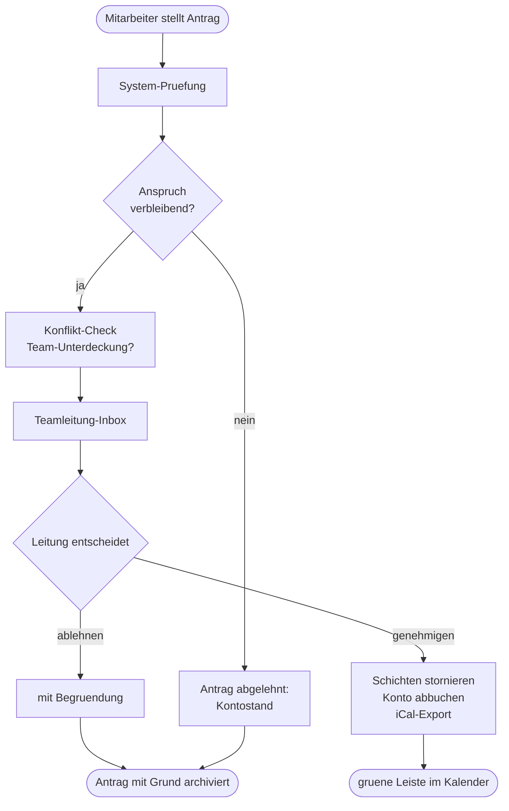

# Urlaub und Abwesenheiten

## Ueberblick

Das Abwesenheiten-Modul verwaltet Urlaub, Krankheit, Fortbildung, Elternzeit und sonstige Nicht-Arbeitszeiten. Abwesenheiten sperren automatisch Schichten im Dienstplan und fliessen in die Kapazitaets- und Lohnberechnung ein.

!!! note "Berechtigung"
    Eigene Antraege stellen: alle Mitarbeiter. Genehmigen/ablehnen: Teamleitung. Globale Sichten: Admin.

## Funktionsweise im Detail

### Das Problem, das wir loesen

Urlaub ist in der Eingliederungshilfe mehr als "bezahlte freie Zeit":

- **Rechtlich** muss jeder Mitarbeiter mindestens 20 Tage pro Jahr
  (bei 5-Tage-Woche) nehmen — BUrlG §3.
- **Organisatorisch** darf nie die gesamte Fachkraefte-Belegung
  gleichzeitig weg sein — Bedarfsdeckung muss gesichert bleiben.
- **Finanziell** muss Urlaub waehrend Kostentraeger-Bewilligungen
  geplant werden; sonst droht Ueber-/Unter-Abrechnung.
- **Abrechnungstechnisch** ist Urlaubszeit im FLS-Stundensatz
  bereits eingepreist (Kalkulationsfaktor 1,33) — trotzdem muss der
  individuelle Saldo stimmen.

Ohne Urlaubsmanagement passiert eins von beidem: Urlaub wird nicht
genommen (gesundheitlich problematisch + am Jahresende aufwaendige
Uebertragung), oder zu viel Urlaub landet auf dem Konto.

### Konkretes Szenario: Urlaubsantrag mit Konfliktpruefung

**05. Juni — Mitarbeiterin Clara will Sommerferien vom 22. Juli bis
12. August.**

1. Sie oeffnet `Urlaub → Neuer Antrag`
2. Typ: Urlaub
3. Zeitraum: 22.07. - 12.08. (22 Tage, davon 15 Arbeitstage)
4. Begruendung optional: "Familienferien Italien"
5. Senden

**System prueft sofort:**

- **Anspruch**: Clara hat 20 Tage Jahresurlaub, 3 bereits verbraucht
  (Ostern) — 15 Tage verbleibend. Antrag passt exakt.
- **Team-Konflikte**: Im Zeitraum sind Mia und Daniel bereits auf
  Urlaub. Das Team "Hauptstrasse" waere mit 3 von 5 Fachkraeften
  weg → **gelbe Warnung**: "Unterdeckung moeglich; Teamleitung
  bitte pruefen."
- **Bestehende Schichten**: Clara hat im Zeitraum 12 geplante
  Schichten → System markiert sie als "umzuplanen" (noch nicht
  storniert).

**06. Juni — Teamleitung Lars entscheidet.**

Lars oeffnet seinen Inbox-Tab `Abwesenheits-Antraege`:

- Claras Antrag mit allen Warnungen
- Er prueft: Mia kommt am 29.07. zurueck, Daniel ab 01.08. — also
  ist die Unterdeckung nur vom 22.07. bis 28.07. akut (3 Mitarbeiter
  weg gleichzeitig, 2 da).
- Er ruft Clara an, bietet ihr an, statt 22.07. erst am 29.07. zu
  starten. Clara lehnt ab (Flug gebucht). Lars nimmt das zur
  Kenntnis.
- Alternative: Er spricht mit Springerin Frida, die bereit ist, die
  Tage 22.-28.07. einzuspringen.
- **Genehmigung** mit Notiz: "Springerin Frida deckt 22.-28.07. ab."

**06. Juni, 18:30 Uhr — System arbeitet.**

Bei Genehmigung passiert automatisch:

1. Urlaubskonto: Clara 15/15 Tage verbraucht — **ausgeschoepft**
2. Bestehende Schichten 22.07.-12.08.: Status `cancelled`, Grund
   "Urlaub genehmigt"
3. Abwesenheits-Eintrag wird im Dienstplan sichtbar (gruene Leiste)
4. iCal-Export enthaelt Claras "Abwesend"-Tage als
   Freizeit-Block — andere sehen im Kalender, wann sie unerreichbar ist
5. Audit-Event `absence.approved` mit Zeitraum + Typ + Genehmigter

**05. Juli — Frida bestaetigt Springerschichten.**

Lars legt die Ersatzschichten an, zugewiesen zu Frida. Konflikt-
Check laeuft: keine Verstoesse. Gespeichert.

**20. Juli — Erinnerung an Clara.**

2 Tage vor Urlaubsbeginn bekommt Clara eine Benachrichtigung:
"Morgen letzter Arbeitstag vor Urlaub. Uebergabe erledigt? Schichten
abgegeben?"

**12. August — Rueckkehr.**

Clara ist zurueck. System wechselt ihren Status automatisch zurueck
auf `aktiv` (kein manueller Eingriff noetig).

### Urlaubsantrag-Flow als Diagramm

<!-- SCREENSHOT: Urlaubsantrag-Formular mit Anspruchs-Anzeige -->
<!-- SCREENSHOT: Team-Kalender mit Urlaubs-Kacheln -->

### Typen der Abwesenheit im Ueberblick

| Typ | Urlaubskonto | Lohn | Genehmigung |
|-----|--------------|------|-------------|
| **Urlaub** | ja (Abzug) | voll | Teamleitung |
| **Krankheit** | nein | Fortzahlung bis 6 Wochen (§3 EFZG) | automatisch, Arbeitgeber-Meldung |
| **Fortbildung** | nein | voll | Admin (Weiterbildungsbudget) |
| **Unbezahlter Urlaub** | nein | 0 | Admin |
| **Elternzeit** | nein | ElterngGeld separat | Admin (lange Planung) |
| **Freistellung** | individuell | individuell | Admin |
| **Sonstige** | individuell | individuell | Admin |

### Krankmeldung — sofort, nicht antraegsgebunden

Krankmeldungen sind **nicht** genehmigungspflichtig (§5 EFZG):
Der Mitarbeiter meldet sich sofort krank, ohne Warten auf Lars'
Entscheidung. System erzeugt den Abwesenheits-Eintrag direkt,
storniert Schichten, benachrichtigt die Teamleitung fuer Ersatz.

AU-Bescheinigung wird ab Tag 3 eingefordert (App-Erinnerung am
Morgen des dritten Krankheitstages mit Upload-Link). Ohne AU nach
3 Tagen: Lohnfortzahlungsanspruch kann strittig werden.

### Urlaubskonto-Mechanik im Detail

Pro Mitarbeiter haelt die App drei Werte:

- `jahresanspruch` — typisch 20-30 Tage (aus Vertrag, anteilig bei
  Teilzeit)
- `resturlaubVorjahr` — uebertragbar bis 31.03. des Folgejahrs
  (§7 Abs. 3 BUrlG) — danach verfaellt
- `verbraucht` — Summe aller genehmigten Urlaubstage dieses Jahres

`verbleibend = jahresanspruch + resturlaubVorjahr - verbraucht`

Wird ein Urlaub storniert (z. B. Krankmeldung mittendrin), werden
die Tage automatisch auf das Konto **zurueck gebucht**. Der
Mitarbeiter sieht die Aenderung sofort.

### Rechtlicher Hintergrund

- **§1 + §3 BUrlG** — mindestens 20 Tage Urlaub pro Jahr bei
  5-Tage-Woche.
- **§5 EFZG** — Anzeigepflicht bei Krankmeldung sofort; AU-Bescheinigung
  ab Tag 3.
- **§3 EFZG** — Entgeltfortzahlung 6 Wochen.
- **§15 BEEG** — Elternzeit-Antraege 7 Wochen vor Beginn, schriftlich.
- **§7 BUrlG** — Urlaubsfestlegung + Uebertragungs-Regeln.
- **§87 BetrVG** — Mitbestimmung bei Urlaubsgrundsaetzen und
  Urlaubsplanerstellung.

## Abwesenheitstypen

| Typ | Beschreibung | Auf Urlaubskonto? |
|-----|-------------|--------------------|
| Urlaub | Regulaerer Jahresurlaub | Ja (Abbuchung) |
| Krankheit | Krankschreibung (AU) | Nein |
| Fortbildung | Dienstlich angeordnet | Nein (bezahlte Arbeitszeit) |
| Unbezahlter Urlaub | Sonder-Urlaub ohne Lohn | Nein |
| Elternzeit | Gesetzliche Elternzeit | Nein (langfristig) |
| Freistellung | Interne Freigabe | Individuell |
| Sonstige | Mit Pflicht-Begruendung | Individuell |

## Urlaubskonto

Jeder Mitarbeiter hat ein Urlaubskonto:

- **Jahresanspruch** aus Arbeitsvertrag (Default: 30 Tage bei Vollzeit, anteilig bei Teilzeit)
- **Resturlaub Vorjahr** — uebertragbar bis 31.03. des Folgejahrs
- **Verbrauchter Urlaub** — laufende Summe aus genehmigten Urlaubseintraegen
- **Verbleibend** — Anspruch − Verbrauch

## Workflow Urlaubsantrag

1. **Mitarbeiter** stellt Antrag mit Zeitraum und Begruendung (optional)
2. System prueft: Anspruch vorhanden? Konflikt mit bestehenden Schichten? Krankmeldung derselben Periode?
3. **Teamleitung** erhaelt Benachrichtigung, genehmigt oder lehnt ab
4. Bei Genehmigung: Schichten im Zeitraum werden storniert (oder zur Umplanung markiert), Urlaubskonto belastet
5. Bei Ablehnung: Grund wird im Antrag dokumentiert, Antrag bleibt fuer Historie

## Krankmeldung

Krankmeldungen sind sofort wirksam (keine Genehmigung noetig). Arbeitsunfaehigkeitsbescheinigung wird optional als Beleg hochgeladen (analog Beleg-Upload im Kassenbuch).

Krankmeldung ab Tag 1 pflicht, AU-Bescheinigung ab Tag 3 (§5 EFZG). Die App erinnert, wenn nach 3 Tagen noch kein Beleg hochgeladen ist.

## Dienstplan-Integration

Bei genehmigter Abwesenheit:

- **Betroffene Schichten** bekommen Status "abgesagt" mit Grund
- **Neuplanung** ist dringend: Dashboard zeigt betroffene Teams
- **iCal-Export** unterdrueckt abgesagte Schichten

## Uebersicht

Der Abwesenheits-Kalender zeigt alle Mitarbeiter eines Teams im Monats-/Jahresraster:

- Urlaub in gruen
- Krankheit in rot
- Fortbildung in blau
- Sonstiges in grau

Geeignet fuer Sichten "Wer ist diese Woche da?" und Exportierbar als Monats-PDF zur Teamsitzung.
