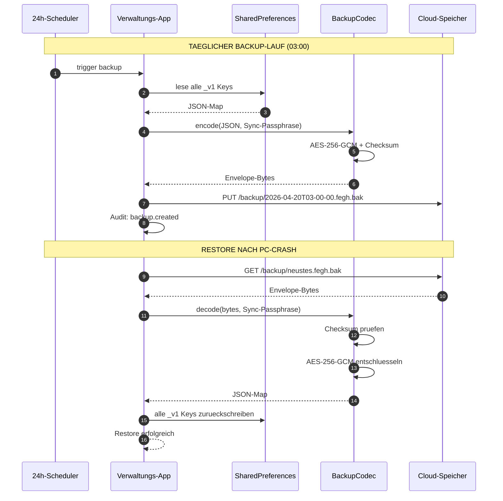

# Backup und Recovery

Die Verwaltung bietet ueber das Shared-Package **`fegh_backup`** verschluesselte Voll-Backups aller Nutzdaten. Gleiche Bausteine nutzen Doku-App und Verwaltung.

## Funktionsweise im Detail

### Das Problem, das wir loesen

Eine Einrichtung kann ohne ihre Daten nicht arbeiten. Verlust
passiert typisch durch:

- **Geraeteschaden / -verlust**: Tablet faellt, Laptop geklaut
- **Software-Fehler**: App crasht, Datenbank-File wird korrupt
- **Bedienfehler**: "Einstellungen zuruecksetzen" zu breit
  interpretiert
- **Malware**: Ransomware verschluesselt die Dateien vor Ort
- **Cloud-Ausfall**: der Cloud-Provider hat einen seltenen
  Totalausfall

Ohne regelmaessiges Backup heisst das: **Monate an Dokumentation
weg**, Rechnungsstellung blockiert, Klientenakte
rekonstruierbar. Mit Backup heisst es: **max. 24 Stunden Rueckstand**
(Backup-Zyklus), Wiederherstellung in ~15 Minuten.

### Konkretes Szenario: Der Tag, an dem der Verwaltungs-PC stirbt

**Donnerstag 09:00 — Anjas Verwaltungs-PC faehrt nicht mehr hoch.** Festplatte hat einen Schaden, Daten sind lokal verloren.

**Kein Grund zur Panik**: Das Backup lief zuletzt am Mittwoch
03:00 Uhr automatisch — also 30 Stunden alt. Alle Daten bis
Mittwoch Abend sind gesichert.

**09:30 — Anja hat neuen Ersatz-PC.**

1. Verwaltungs-App frisch installieren.
2. Beim Start: Setup-Wizard → "Backup wiederherstellen" waehlen.
3. Cloud-Credentials eingeben (die liegen im Tresor bei den
   Recovery-Codes).
4. System findet unter `/backup/` mehrere Voll-Backups, neuestes
   von Mittwoch Nacht wird ausgewaehlt.
5. Anja gibt ihre Sync-Passphrase ein → Backup wird entschluesselt.
6. `SharedPreferences` werden wiederhergestellt: Klienten, Teams,
   Rechnungen, Medikationsplaene, Kassenbuch — alles zurueck.

**10:15 — Einsatzfaehig.** Anja hat 75 Minuten Ausfall und 30
Stunden an Daten verloren. Fuer die 30 Stunden muss sie:

- Donnerstag-Vormittag-Termine aus dem Tablet der Mitarbeiterin
  (Mia hat dort bereits offline dokumentiert) uebernehmen — geht
  ueber Cloud-Sync automatisch.
- Eine Bar-Zahlung vom Donnerstag 08:00 manuell nachbuchen.

**11:00 — Everything back to normal.**

### Backup + Restore als Sequenzdiagramm



<!-- SCREENSHOT: Backup-Uebersicht mit Liste der letzten Backups -->
<!-- SCREENSHOT: Restore-Dialog mit Backup-Auswahl -->

### Was konkret im Backup ist

Ein Backup ist eine **verschluesselte Datei** (typisch 500 KB - 5 MB
je nach Einrichtungsgroesse), die folgende SharedPreferences-Keys
enthaelt:

- `clients_v1` (alle Klient-Records)
- `teams_v1` (Team-Struktur + Mitgliedschaften)
- `employees_v1` (Mitarbeiter-Daten)
- `shifts_v1` (Dienstplan)
- `shift_swap_requests_v1` (Tausch-Anfragen)
- `medications_v1` + `medication_administrations_v1`
- `btm_entries_v1` + `btm_destructions_v1`
- `kassenbuch_eintraege_v1` + `kassenbuch_monatsabschluesse_v1`
- `wohnraum_v1`
- `rechnungen_v1` + `rechnung_empfaenger_v1`
- `settings_v1`
- `audit.log` (aktuelles Log)

**Nicht im Backup**:
- Keys (MEK, DEK, Team-Keys) — die sind geraetegebunden und
  separat per Recovery-Code wiederherstellbar.
- Transiente Cache-Dateien.
- Lokale Einstellungen des einzelnen Geraets (Theme, Layout).

### Das Backup-Envelope-Format

`fegh_backup` schreibt ein **self-contained, AES-256-GCM
verschluesseltes Envelope**:

```
BEGIN FEGH BACKUP v1
version: 1
created: 2026-04-20T03:00:00Z
appVersion: 0.3.0-beta.1
orgId: assistenz-ggmbh
records: 12
checksum: SHA-256:<hex>
--- encrypted payload ---
<AES-256-GCM ciphertext>
--- end encrypted payload ---
END FEGH BACKUP v1
```

Entschluesselung braucht **zwei Dinge**:

1. Die **Sync-Passphrase** (aus Settings, PBKDF2-abgeleitet)
2. Die **Checksum** muss uebereinstimmen (gegen bit-rot oder
   Truncation)

Der `RecoveryService` validiert beides und fuehrt den Restore
atomar durch: entweder alles oder nichts.

### Rhythmus und Retention

- **Standard**: 1x taeglich 03:00 Uhr, Ablage in Cloud `backup/`
- **Retention**: 30 Tage rolliert, danach wird das aelteste Backup
  geloescht
- **Manuell**: jederzeit ueber `Admin-Console → Backup → Jetzt
  sichern` ausloesbar

Fuer Einrichtungen mit sehr hohem Schutzbedarf: Zusaetzliches
Offline-Backup auf verschluesseltem USB-Stick (manuell, 1x pro
Monat) sorgt fuer Immunitaet gegen Ransomware-Angriffe, die auch
die Cloud erreichen.

### Rechtlicher Hintergrund

- **Art. 32 Abs. 1 lit. b DSGVO** — "Faehigkeit, die
  Vertraulichkeit, Integritaet, Verfuegbarkeit und Belastbarkeit
  der Systeme und Dienste im Zusammenhang mit der Verarbeitung auf
  Dauer sicherzustellen". Backup = Verfuegbarkeit.
- **Art. 32 Abs. 1 lit. c DSGVO** — "Faehigkeit, die Verfuegbarkeit
  der personenbezogenen Daten und den Zugang zu ihnen bei einem
  physischen oder technischen Zwischenfall rasch
  wiederherzustellen". Wiederherstellungszeit = Teil des
  Notfallkonzepts.
- **BSI IT-Grundschutz CON.3** — Datensicherungskonzept.
  Die Retention + Offline-Option erfuellt die Anforderungen fuer
  mittleren Schutzbedarf.
- **HGB §257** — Rechnungsdaten 10 Jahre aufbewahren; das
  Cloud-Backup plus ein jaehrliches Archiv-Backup deckt das ab.

## Was wird gesichert?

Das Backup umfasst die wichtigen SharedPreferences-Keys:

- Mitarbeiter, Teams, Klienten
- Schichten, Urlaub, Zeitnachweise
- Rechnungen und Empfaenger
- Medikationsplaene und -quittungen
- Wohnraum und Kassenbuch-Eintraege
- Benachrichtigungen und Settings

**Nicht enthalten**: Cloud-Zugangsdaten (Cloud-Benutzer und -Passwort) und Master-Encryption-Key (MEK). Diese sind geraetegebunden — nach einer Wiederherstellung muessen sie neu hinterlegt werden.

## Dateiformat

Ein Backup ist eine einzelne `.ehbackup`-Datei mit folgendem Byte-Layout:

```
[ 1 Byte Version (0x01) ]
[ 16 Byte Salt          ]
[ 12 Byte Nonce         ]
[ 16 Byte GCM-MAC       ]
[ n Bytes Ciphertext    ]
```

Der Ciphertext ist ein JSON-Envelope mit:

- **Metadaten**: Backup-ID, Erstellzeit, Geraet, App-Version, Daten-Version
- **Payload**: Eine Map `<Key, JSON-String>` aller gesicherten SharedPreferences-Keys

## Kryptographie

- **AES-256-GCM** (authentifizierte Verschluesselung)
- **PBKDF2 mit HMAC-SHA-256 und 100 000 Runden** fuer den Key aus dem Passwort
- **Zufaelliges Salt** pro Backup — gleiches Passwort erzeugt nie dasselbe Output

Ein GCM-Tag am Anfang verhindert nachtraeglich modifizierte Dateien — Manipulation fuehrt zu einem kontrollierten Entschluesselungsfehler.

## Bedienung

*Einstellungen → Backup & Wiederherstellung → Backup-Manager oeffnen* zeigt drei Sektionen:

1. **Backup erstellen** — Passwort vergeben (doppelt eingegeben), sofortige Erzeugung in `ApplicationSupportDirectory/backups/`.
2. **Backup wiederherstellen** — Datei auswaehlen, Passwort eingeben, Warn-Dialog bestaetigen. Bestehende Daten werden **ueberschrieben**.
3. **Liste vorhandener Backups** — mit Dateigroesse, Erstelldatum, Restore- und Delete-Action pro Eintrag.

## Recovery-Phrase (Admin-MEK)

Unabhaengig vom Backup bietet `fegh_backup` die **12-Wort Recovery-Phrase** fuer Administratoren — ein zweiter Weg, den Master-Encryption-Key wiederherzustellen, falls die Sync-Passphrase verloren geht:

- 12 Woerter aus einer deutschen 128-Wort-Liste (nicht BIP39)
- MEK wird mit der Phrase verschluesselt und optional auf der Cloud abgelegt
- PBKDF2 mit 50 000 HMAC-SHA-256-Runden fuer die Key-Ableitung

Die Phrase wird **einmal angezeigt**, sollte physisch notiert und an einem sicheren Ort aufbewahrt werden (Tresor, Wertschließfach).

## Was tun bei Verlust?

| Verlust | Ausweg |
|---------|--------|
| Cloud-Passwort | Neu vergeben im Cloud-Portal, in der App anpassen |
| Sync-Passphrase | Recovery-Phrase nutzen, MEK wiederherstellen |
| Recovery-Phrase | Keine Datenwiederherstellung moeglich — **Daten verloren** |
| Backup-Passwort | Kein Zugriff auf die konkrete Backup-Datei |

Die **drei Geheimnisse** (Cloud-Passwort, Sync-Passphrase, Recovery-Phrase) sollten getrennt und redundant aufbewahrt werden — mindestens eine Instanz jeweils offline.

## Geplant (nicht im MVP)

- Automatisches taegliches Backup in die Cloud
- Recovery-Code fuer einzelne Mitarbeiter (Passwort-Reset via Teamleitung)
- Incremental Backup statt Voll-Backup

## Siehe auch

- [Shared-Packages](../technik/shared-packages.md) — `fegh_backup` im Detail
- [Audit-Log](audit.md) — Backup-Events sind protokolliert
