# Rechnungsmodul

Das Rechnungsmodul der FEGH-Verwaltung erstellt und versendet **XRechnungen nach EN 16931 / UBL 2.1 (KoSIT 3.0)**. Es richtet sich primaer an Traeger, die Leistungen nach dem SGB IX (Eingliederungshilfe) an Kostentraeger wie Jugendaemter, Sozialaemter oder die Teilhabebehoerde abrechnen.

## Funktionsweise im Detail

### Das Problem, das wir loesen

Eine EGH-Rechnung ist keine normale Handelsrechnung. Sie hat
**mindestens 12 Pflichtfelder**, die ueber das allgemeine
Rechnungsrecht (§14 UStG) hinausgehen:

- **Leitweg-ID** (BT-10) des Kostentraegers — eindeutiger Kanal
  ins Verwaltungsnetz
- **Aktenzeichen / Fallnummer** (cbc:Description in der Position)
  — pro Kostentraeger unterschiedlich, Pflicht fuer Zuordnung
- **Leistungstyp-Schluessel** aus Rahmenvertrag (z. B. "B5.01")
- **Bewilligungsbescheid-Referenz** (Geschaeftszeichen)
- **Steuerbefreiungsgrund** als VATEX-EU-Code + deutscher
  Klartext (BR-S-07)
- **CustomizationID** XRechnung 3.0.2 (nicht 2.x, nicht 3.0.1)
- **BG-6 SELLER CONTACT** mit Name **und** Telefon **und** Email
  — alle drei Pflicht (BR-DE-6/7)
- **InvoicePeriod** an der richtigen Stelle im XML (UBL-Schema-
  Reihenfolge kaempft gegen intuitive Sortierung)
- **IBAN ohne Leerzeichen** im Zahlungsteil
- **Netto-Brutto-Konsistenz** (Summen muessen aufgehen, sonst
  Rejection)

Eine haendisch erstellte XRechnung in Word + XML-Konverter hat
nach unserer Erfahrung **in 7 von 10 Faellen** einen der obigen
Fehler — die Rechnung wird dann vom Kostentraeger abgelehnt, oft
kommentarlos. Der Leistungserbringer merkt das erst nach 6 Wochen
ausbleibender Zahlung und weiss nicht, was falsch war.

Das Rechnungsmodul kondensiert all diese Regeln: **validiert beim
Erstellen, kann nichts vergessen werden, produziert konforme XML**.

### Konkretes Szenario: Der April-Monatslauf

**01. Mai 2026, 09:00 Uhr — Admin Anja startet den Monatslauf.**

Die Einrichtung hat im April fuer 12 Klienten Leistungen erbracht,
aufgeteilt auf 3 Kostentraeger:

| Kostentraeger | Klienten | FLS April | Summe |
|---------------|----------|-----------|-------|
| Sozialamt Friedrichshain-Kreuzberg | 7 | 168 h | 8.736 EUR |
| Bezirksamt Mitte | 3 | 72 h | 3.744 EUR |
| Jugendamt Neukoelln | 2 | 42 h | 2.184 EUR |

1. `Berichte → Rechnungen → Monatslauf`
2. Zeitraum: April 2026, alle aktiven Empfaenger
3. System aggregiert:
   - **Kliententermine** (direkte Zeit)
   - **Buero- und Doku-Termine mit Fallbezug** anteilig verteilt
   - Kappung auf bewilligte Stunden pro Klient
4. Review-Dialog zeigt Breakdown pro Empfaenger, pro Klient, pro
   Stunde. Anja validiert.
5. **Pro Kostentraeger eine Rechnung** wird erzeugt (3 Rechnungen
   insgesamt).

**09:15 Uhr — Plausi-Check laeuft automatisch:**

Fuer jede Rechnung prueft das System:

- ✓ Leitweg-ID formal gueltig (Regex + Pruefziffer)
- ✓ Alle Klienten haben Fallnummer beim Kostentraeger
- ✓ Rechnungssteller-Daten vollstaendig (Telefon, Email, IBAN, USt-
  ID — fehlt einer, wuerde KoSIT BR-DE-6/7 ausloesen)
- ✓ VATEX-Code + Klartext vorhanden
- ✓ Netto + Steuer = Brutto (rundungs-korrekt auf 2 Dezimalstellen)

Fehlt etwas: **ArgumentError, Rechnung wird nicht erzeugt**. So
verhindert das System, dass eine kaputte XML ueberhaupt entsteht.

**09:20 Uhr — XRechnung-XML-Export.**

Jede der 3 Rechnungen wird als UBL-XML geschrieben:

```
rechnung-2026-04-001.xml  (7 KB)  - Sozialamt Friedrichshain
rechnung-2026-04-002.xml  (4 KB)  - Bezirksamt Mitte
rechnung-2026-04-003.xml  (3 KB)  - Jugendamt Neukoelln
```

Anja laedt alle drei **ueber das OZG-RE-Portal** hoch. Das Portal
validiert serverseitig gegen KoSIT-Schematron — alle drei gehen
durch (das Modul hat sich an den echten Validator gehalten, siehe
[Test-Tools](../technik/test-tools.md) fuer den Integrationstest).

**09:30 Uhr — Statuswechsel auf "Versendet".**

Anja markiert die 3 Rechnungen in der Uebersicht, Menue →
"Alle auf versendet setzen". Audit-Events `rechnung.status` mit
alt/neu.

**14. Mai — Zahlungseingang #1.**

Das Bezirksamt Mitte hat gezahlt (3.744 EUR, Referenz
"2026-04-002"). Anja setzt Status auf "Bezahlt".

**Mitte Juni — Erinnerung.**

Das Dashboard zeigt: **Sozialamt Friedrichshain-Kreuzberg, Faellig
seit 30+ Tagen**. Anja schreibt eine Mahnung aus der App.

### Vom Monatslauf zur elektronisch eingereichten Rechnung

```mermaid
flowchart LR
    Start([Monatslauf-Button]) --> Agg[Aggregate Termine<br/>+ Arbeitszeit]
    Agg --> Split[Split nach<br/>Kostentraeger]
    Split --> Cap[Kappung auf<br/>Bewilligtes]
    Cap --> Review[Review-Dialog]
    Review --> Plausi[Plausi-Check<br/>harte Felder]
    Plausi -->|FAIL| Block([Abbruch])
    Plausi -->|OK| Build[XRechnungService<br/>.buildXml]
    Build --> Validate[intern: Pflichtfelder?<br/>ArgumentError bei Luecke]
    Validate --> UBL[UBL 2.1 XML-Datei]
    UBL --> Download[Download auf PC]
    Download --> OZG[manueller Upload<br/>OZG-RE-Portal]
    OZG --> KoSIT[KoSIT-Schematron<br/>Validation]
    KoSIT -->|accept| KT[Kostentraeger]
    KoSIT -->|reject| Feedback[Fehler-Report]
    KT -.zahlt.-> Konto[Bankkonto]
```



<!-- SCREENSHOT: Rechnungs-Uebersicht mit Status-Spalte -->
<!-- SCREENSHOT: XRechnung-Detail mit allen Pflichtfeldern -->

### Die kritischen KoSIT-Pflichtfelder in der Deep-Dive

Wir haben waehrend der Entwicklung **4 echte Produkt-Bugs** via
KoSIT-Integrationstests gefunden und gefixt:

1. **Alte CustomizationID** (`urn:xoev-de:kosit:...`) statt der neuen
   seit 3.0.2 (`urn:xeinkauf.de:kosit:...`) — matched kein Scenario.
2. **InvoicePeriod an falscher Stelle** — UBL-Schema verlangt es
   VOR AccountingSupplierParty, nicht danach.
3. **cac:Item Description nach Name** — UBL erlaubt Description
   nur ALS ERSTES, nicht nach Name.
4. **BG-6 Seller Contact fehlt** wenn kein Ansprechpartner gesetzt
   — BR-DE-2 verlangt Contact-Gruppe immer, mit mind. Name (kann
   Firma sein).

Ohne Test waeren diese Bugs erst beim ersten Live-Einsatz beim
Kostentraeger aufgefallen — mit entsprechenden Zahlungsverzoegerungen
und Image-Schaden. Die Tests laufen jetzt gegen den echten KoSIT-
Validator (Java-JAR), nicht nur String-Matching.

### Storno-Workflow

Versendete Rechnungen sind **nicht aenderbar** (GoBD §146 AO). Bei
Fehler:

1. Kontextmenue → **Stornieren** auf die Original-Rechnung
2. System erzeugt eine neue Rechnung mit:
   - Negativen Mengen (Summen werden negativ)
   - Rechnungsnummer mit `-ST`-Suffix
   - Bemerkung "Storno zu 2026-04-001"
   - Verweis auf Original via `stornoFuerRechnungId`
3. Original wird automatisch auf "Storniert" gesetzt
4. Neue, korrigierte Rechnung wird manuell erstellt

### Rechtlicher Hintergrund

- **§14a UStG + ERechVBln (Berlin)** — E-Rechnung an oeffentliche
  Auftraggeber Pflicht seit 2020, fuer B2B seit 01.01.2025.
- **EN 16931** — europaeische Norm fuer elektronische Rechnung.
- **XRechnung 3.0.2** — deutsche Umsetzung (KoSIT), mit CIUS
  ueber EN 16931.
- **§125 SGB IX** — Verguetungsvereinbarung bestimmt Stundensatz.
- **§4 Nr. 16 Buchst. h UStG** — Steuerbefreiung EGH; VATEX-EU-
  132-1G ist die Code-Repraesentation.
- **§146 Abs. 4 AO / GoBD** — Versendete Rechnungen duerfen nicht
  rueckwirkend geaendert werden; Storno + Neu ist der Weg.
- **HGB §257 + AO §147** — Aufbewahrung 10 Jahre.

## Warum XRechnung?

Seit dem **01.01.2025** ist die E-Rechnung fuer B2B-Umsaetze in Deutschland Pflicht. Oeffentliche Auftraggeber (Bund, Laender, Kommunen) verlangen sie bereits seit 2020. Unsere Zielgruppe — Kostentraeger in der EGH — fordert zunehmend XRechnung statt PDF.

## Aufbau

Das Modul nutzt das geteilte Paket `fegh_billing`, das zwischen Doku-App und Verwaltung aufgeteilt ist:

- **Modelle**: `Rechnung`, `RechnungsPosition`, `RechnungEmpfaenger`, `Kostentraeger`, `UstBefreiungsgrund`.
- **Service**: `XRechnungService` generiert den UBL 2.1 XML-Output mit korrektem Namespace, CustomizationID `urn:cen.eu:en16931:2017#compliant#urn:xoev-de:kosit:standard:xrechnung_3.0`.
- **VATEX-Codes** fuer Steuerbefreiungsgruende nach KoSIT-Codeliste 3.0. §4 UStG-Befreiungen werden auf die korrespondierende MwStSystRL-Vorschrift abgebildet:

| Paragraph | VATEX-EU (KoSIT 3.0) | MwStSystRL | Anwendung |
|-----------|----------------------|------------|-----------|
| §4 Nr. 16 h UStG | `VATEX-EU-132-1G` | Art. 132(1)(g) | Leistungen der Eingliederungshilfe |
| §4 Nr. 18 UStG | `VATEX-EU-132-1G` | Art. 132(1)(g) | Leistungen der anerkannten Wohlfahrtspflege |
| §4 Nr. 25 UStG | `VATEX-EU-132-1H` | Art. 132(1)(h) | Jugendhilfeleistungen |

Der `TaxExemptionReasonCode` im UBL-XML wird auf den jeweiligen VATEX-EU-Wert gesetzt, der `TaxExemptionReason` traegt den deutschen Klartext (z. B. „Steuerfreie Leistung nach §4 Nr. 16 Buchst. h UStG").

## Ablauf

1. **Empfaenger anlegen** (Kostentraeger) — einmalig pro Jugendamt / Sozialamt, inkl. Leitweg-ID.
2. **Rechnung erstellen** — Klient- oder Leistungs-bezogen, Positionen manuell oder aus Fachleistungsstunden generiert.
3. **UStG-Befreiungsgrund waehlen** — meist §4 Nr. 16h UStG.
4. **XRechnung generieren** — XML-File im UBL-Format, validierbar gegen KoSIT-Schema.
5. **PDF-Begleitdokument** — per `fegh_pdf_kit` erzeugt, identisches Design wie andere Reports.

## Uebermittlung

Die XRechnung selbst wird als XML-Datei erzeugt. Die Uebermittlung an den Kostentraeger erfolgt je nach Anforderung:

- E-Mail-Anhang (XML)
- Upload im Kostentraeger-Portal
- Peppol-BIS-Format (nicht im MVP — manueller Export)

Eine direkte Peppol-Anbindung ist nicht enthalten; die erzeugte XRechnung ist aber valide Peppol-BIS-Billing-3.0.

## Nummernkreis

Rechnungsnummern folgen dem Muster `YYYY-NNNN`, fortlaufend pro Jahr. `naechsteRechnungsnummer()` des Services ermittelt die naechste freie Nummer auf Basis der bereits gespeicherten Rechnungen.

## Siehe auch

- [Shared-Packages](../technik/shared-packages.md) — Aufbau des geteilten `fegh_billing`
- [Audit-Log](audit.md) — alle Rechnungs-Aktionen sind protokolliert
