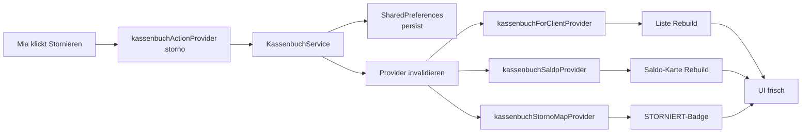

# State-Management (Riverpod)

Die Verwaltung nutzt **Riverpod 2.x** durchgaengig. Jede persistente Entitaet hat einen Service, einen Provider und einen optionalen ActionNotifier.

## Funktionsweise im Detail

### Das Problem, das wir loesen

Eine Desktop-App mit 20+ Modulen hat schnell **komplexe
State-Abhaengigkeiten**:

- Ein Schicht-Update soll die Kapazitaets-Anzeige im Dashboard
  aktualisieren.
- Ein Klient-Wechsel soll die Kassenbuch-Liste neu laden.
- Eine Monatsabschluss-Aktion soll den Saldo-Provider, die
  Abschluesse-Map und die Einzelbuchungs-Liste invalidieren.

Ohne State-Management-Bibliothek endet das in manueller
`setState()`-Kaskaden, die schwer nachvollziehbar sind. **Riverpod**
schafft klare Abhaengigkeitsbaeume, deklarative Reactivity und
testbare Provider.

### Konkretes Szenario: Ein Kassenbuch-Storno propagiert

So wirkt ein einzelner Storno-Klick auf den State:

1. **Mia klickt "Stornieren"** im Kontextmenue.
2. Dialog ruft `kassenbuchActionProvider.notifier.storno(...)` auf.
3. Der Notifier:
   - ruft `KassenbuchService.stornoEintrag(...)` auf
   - erzeugt die Gegenbuchung lokal
   - persistiert sie in SharedPreferences
4. Nach Erfolg ruft der Notifier `_invalidate(clientId)` auf:
   ```dart
   _ref.invalidate(kassenbuchForClientProvider(clientId));
   _ref.invalidate(kassenbuchSaldoProvider(clientId));
   _ref.invalidate(kassenbuchStornoMapProvider(clientId));
   ```
5. Riverpod markiert alle drei Provider als "stale".
6. Widgets, die einen dieser Provider watchen, werden rebuild.
7. `KassenbuchScreen` sieht:
   - Neue Liste mit dem Storno-Eintrag oben
   - Aktualisierter Saldo
   - Das Original bekommt das "STORNIERT"-Badge (weil
     `stornoMapProvider` jetzt eine Zuordnung hat)

Alles deklarativ, ohne `setState`, ohne manuelle Event-Bus-Logik.

### Kassenbuch-Storno-Propagation als Diagramm



### Das Standard-Muster pro Entitaet

Fuer jede persistente Entitaet haben wir **drei Provider**:

```dart
// 1. Service (Singleton, kein State)
final kassenbuchServiceProvider =
    Provider<KassenbuchService>((ref) => KassenbuchService());

// 2. Daten-Provider (Family, reaktiv auf Aenderungen)
final kassenbuchForClientProvider = FutureProvider.family
    .autoDispose<List<KassenbuchEintrag>, String>((ref, clientId) async {
  return ref.watch(kassenbuchServiceProvider).loadForClient(clientId);
});

// 3. Action-Notifier (stateful, fuehrt Mutationen aus)
final kassenbuchActionProvider =
    StateNotifierProvider<KassenbuchActionNotifier, AsyncValue<void>>(
        (ref) => KassenbuchActionNotifier(ref));
```

Das Muster ist **repetitive Boilerplate**, aber macht die Apps
erwartbar: wer ein neues Modul baut, schaut sich ein bestehendes
an und kopiert die Struktur.

### `autoDispose` — wann ja, wann nein

- **autoDispose: ja** bei Provider, die nur kurz gebraucht werden
  (ein `KassenbuchScreen` fuer einen Klienten). Riverpod raeumt
  den Cache auf, sobald kein Widget mehr watcht.
- **autoDispose: nein** bei global benoetigten Providern
  (`teamsProvider`, `employeesProvider`). Die sind fast ueberall
  gelesen, Neuladen waere Verschwendung.

### Invalidate vs. Refresh

- `ref.invalidate(provider)` markiert als stale. Naechste Watch
  triggert Neuladen. **Standardweg** bei Mutationen.
- `ref.refresh(provider)` triggert sofort neuen Lauf und gibt
  Future zurueck. Nur noetig, wenn man auf die frischen Daten
  noch im aktuellen Kontext reagieren will.

In der App fast immer `invalidate` — das UI rebuild laeuft
async, ist nicht zeitkritisch.

### StateNotifier vs. FutureProvider

- `FutureProvider` fuer **read-only Daten** aus einer Quelle
  (SharedPreferences, HTTP, Dateisystem).
- `StateNotifier` fuer **Mutationen** und komplexe States mit
  Unter-Zustaenden (loading/success/error + Zwischenergebnisse).

Ein StateNotifier haelt einen eigenen State und aktualisiert ihn
mit `state = newValue`. Das Widget, das ihn watcht, rebuild.

### Riverpod-Test-Tipps

- Provider sind **nicht** an Flutter gebunden — testbar mit
  `flutter_test` UND mit `test`.
- `ProviderContainer` fuer Unit-Tests: kein Widget-Tree noetig,
  direkt `container.read(provider)` lesen.
- Overrides fuer Test-Mocks:
  `ProviderScope(overrides: [kassenbuchServiceProvider.overrideWithValue(mockService)])`.
- Family-Provider mit `ProviderContainer.read(provider(argument))`.

### Wann Riverpod ueberfordert ist

Manchmal ist der Riverpod-Baum falsch das Tool:

- **Globale Cross-Widget-Animationen** → besser `AnimationController`
  lokal.
- **Browser-History** → besser `go_router` (nicht Riverpod-Aufgabe).
- **Pure-UI-State** (z. B. "ist Dialog offen?") → stateful Widget
  reicht.

Die App nutzt Riverpod, wo **Daten + App-Logik** zusammenkommen;
reine UI-Zustaende bleiben in StatefulWidgets.

## Muster

```dart
// 1) Service-Provider (stateless, Singleton)
final employeeServiceProvider =
    Provider<EmployeeService>((ref) => EmployeeService());

// 2) Daten-Provider (FutureProvider oder StateNotifier)
final employeesProvider = FutureProvider<List<Employee>>((ref) async {
  return ref.watch(employeeServiceProvider).loadAll();
});

// 3) Action-Notifier fuer Schreibaktionen
final employeeActionProvider =
    StateNotifierProvider<EmployeeActionNotifier, AsyncValue<void>>(
        (ref) => EmployeeActionNotifier(ref));

class EmployeeActionNotifier extends StateNotifier<AsyncValue<void>> {
  final Ref _ref;
  EmployeeActionNotifier(this._ref) : super(const AsyncValue.data(null));

  Future<bool> add(Employee e) async {
    state = const AsyncValue.loading();
    final ok = await _ref.read(employeeServiceProvider).addEmployee(e);
    state = const AsyncValue.data(null);
    if (ok) _ref.invalidate(employeesProvider);
    return ok;
  }
}
```

**Der Punkt**: Services kapseln I/O, Data-Provider kapseln Lesestatus, Action-Notifier kapseln Ausfuehrungsstatus. Widgets machen `ref.watch(...)` fuer Daten und `ref.read(...notifier).action()` fuer Aktionen.

## FutureProvider.family

Bei klient- oder tag-spezifischen Queries nutzen wir `Provider.family.autoDispose`:

```dart
final medicationsForClientProvider = FutureProvider.family
    .autoDispose<List<Medication>, String>((ref, clientId) async {
  return ref.watch(medicationServiceProvider).loadForClient(clientId);
});
```

`autoDispose` gibt die Ressourcen frei, sobald kein Widget mehr `ref.watch`-et. Das ist fuer selten besuchte Screens wichtig (Klient-Profil).

## Invalidation

Action-Notifier muessen die abhaengigen Provider invalidieren:

```dart
void _invalidate(String clientId) {
  _ref.invalidate(kassenbuchForClientProvider(clientId));
  _ref.invalidate(kassenbuchSaldoProvider(clientId));
}
```

Wer das vergisst, erlebt UI-Gespenster: eine erfolgreiche Aktion scheint nichts zu bewirken, weil der Provider nicht neu lief. Das passiert hauptsaechlich bei **Family-Providern**, wo die Identitaet (`clientId`, `DateTime`) auf das Byte genau stimmen muss.

## Kein BuildContext-Smuggling

Provider duerfen keinen `BuildContext` halten. Alle UI-Interaktionen (SnackBar, Dialog, Navigator) bleiben in den Widgets selbst. Aus Notifiern werfen wir `bool`-Rueckgabewerte oder `AsyncValue.error(...)` — die Widgets rendern daraus Fehlermeldungen.

## Testbarkeit

Provider koennen in Tests mit `ProviderScope(overrides: [...])` ersetzt werden. Fuer Services nutzen wir `SharedPreferences.setMockInitialValues({})`, um die Persistenz in-memory zu halten. Siehe z. B. `test/medication_service_test.dart`.

## Warum Riverpod, nicht Provider oder Bloc?

- **Compile-time-Safety**: Kein `Provider.of<X>(context)`-Match.
- **Keine InheritedWidget-Aufraeumerei**: Provider werden global deklariert, nicht in den Widget-Baum gehaengt.
- **AutoDispose**: Ressourcen-Lifecycle explizit.
- **Schlankere Tests**: Kein Bloc-Event/State-Ping-Pong fuer einfache CRUD-Aktionen.

Die Doku-App nutzt historisch **`provider` (ohne Ri)**. Die Verwaltung-App ist auf Riverpod gestartet und hat sich bewaehrt — ein Umbau der Doku ist nicht geplant, weil der Nutzen begrenzt und der Aufwand gross waere.

## Siehe auch

- [Architektur](architektur.md)
- [Offizielle Riverpod-Docs](https://riverpod.dev/)
